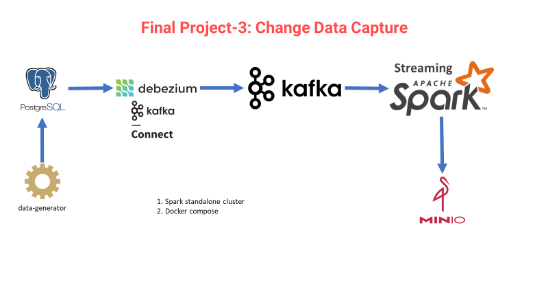

# VBO Data Engineering Bootcamp Final Project-3: Change Data Capture
In this project you are expected to grap data changes in postgresql and flow it through Kafka, Spark Streaming and Object storage (MinIO).

You must capture changes  like insert, delete, update in customers table. You can follow the steps below:

## Step 1: Create docker-compose.yaml

Services that should be in the container:

- spark
- postgresql
- minio
- kafka
- kafka-connect
- zookeeper

## Step 2: Create Debezium PostgreSQL connector

## Step 3: Create Kafka Console Consumer

## Step 4: Write to Postgtresql with data-generator

Just write the first 1000 records.

- Data source: <https://raw.githubusercontent.com/erkansirin78/datasets/master/retail_db/customers.csv>

## Step 5: Conncet to Postgresql Shell

- Detele a row
  - The sample is expected at the Consumer terminal

        ```
        {
            "schema": { ... },
            "payload": {
                "before": {
                    "customerId": 1,
                    "customerFName": null,
                    "customerLName": null,
                    "customerEmail": null,
                    "customerPassword": null,
                    "customerStreet": null,
                    "customerCity": null,
                    "customerState": null,
                    "customerZipcode": null
                },
                "after": null,
                "source": {
                    "version": "1.9.6.Final",
                    "connector": "postgresql",
                    "name": "dbserver1",
                    "ts_ms": 1666164350827,
                    "snapshot": "false",
                    "db": "postgres",
                    "sequence": "[\"37082784\",\"37082784\"]",
                    "schema": "public",
                    "table": "customers",
                    "txId": 778,
                    "lsn": 37082784,
                    "xmin": null
                },
                "op": "d",
                "ts_ms": 1666164351137,
                "transaction": null
            }
        }
        ```

- Update a row
  - The sample is expected at the Consumer terminal

        ```
        {
            "schema": {...},
            "payload": {
                "before": null,
                "after": {
                    "customerId": 3,
                    "customerFName": "test",
                    "customerLName": "Smith",
                    "customerEmail": "XXXXXXXXX",
                    "customerPassword": "XXXXXXXXX",
                    "customerStreet": "3422 Blue Pioneer Bend",
                    "customerCity": "Caguas",
                    "customerState": "PR",
                    "customerZipcode": 725
                },
                "source": {
                    "version": "1.9.6.Final",
                    "connector": "postgresql",
                    "name": "dbserver1",
                    "ts_ms": 1666164929489,
                    "snapshot": "false",
                    "db": "postgres",
                    "sequence": "[\"37092672\",\"37101112\"]",
                    "schema": "public",
                    "table": "customers",
                    "txId": 780,
                    "lsn": 37101112,
                    "xmin": null
                },
                "op": "u",
                "ts_ms": 1666164929967,
                "transaction": null
            }
        }
        ```

## Step 6: Write to Minio

- Create a bucket

## Step 7: Spark Streaming

- Read the messages from Kafka using Spark.
- Parse JSON data
  - Expected schema

    ```
    root
    |-- payload.before.customerId: string (nullable = true)
    |-- payload.before.customerFName: string (nullable = true)
    |-- payload.before.customerLName: string (nullable = true)
    |-- payload.before.customerEmail: string (nullable = true)
    |-- payload.before.customerPassword: string (nullable = true)
    |-- payload.before.customerStreet: string (nullable = true)
    |-- payload.before.customerCity: string (nullable = true)
    |-- payload.before.customerState: string (nullable = true)
    |-- payload.before.customerZipcode: string (nullable = true)
    |-- payload.after.customerId: string (nullable = true)
    |-- payload.after.customerFName: string (nullable = true)
    |-- payload.after.customerLName: string (nullable = true)
    |-- payload.after.customerEmail: string (nullable = true)
    |-- payload.after.customerPassword: string (nullable = true)
    |-- payload.after.customerStreet: string (nullable = true)
    |-- payload.after.customerCity: string (nullable = true)
    |-- payload.after.customerState: string (nullable = true)
    |-- payload.after.customerZipcode: string (nullable = true)
    |-- payload.ts_ms: string (nullable = true)
    |-- payload.op: string (nullable = true)
    ```

- Write to Minio



----